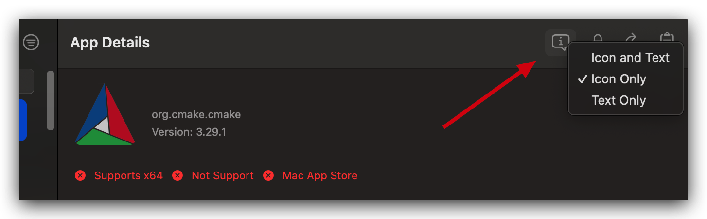
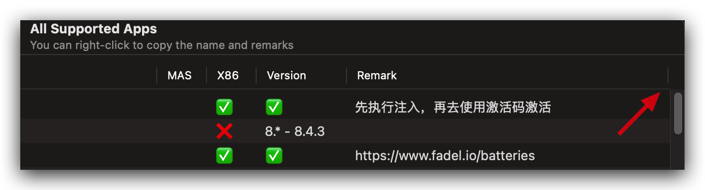
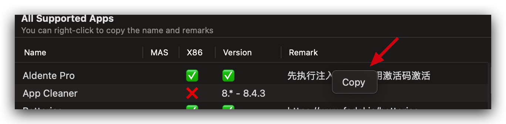
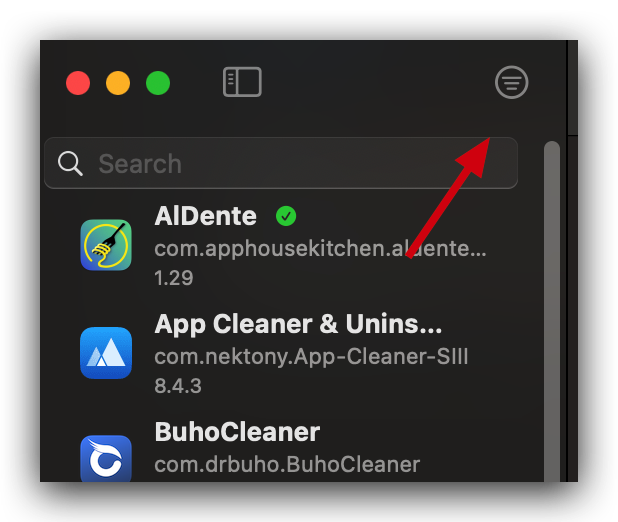

<div>
<h3>TrialMacAppGUI</h3>
<p>更改软件逻辑，以达到延长许多应用程序试用时间的目的</p>
<a href="https://github.com/TrialMacApp/TrialMacApp/releases/latest">Download for macOS</a>
</div>

<br/>
<br/>

<div align="center">


<br/>
<br/>

<a href="readme.md">English</a> | <a href="readme_zh-Hans.md">简体中文</a>

</div>

<hr>

## 支持的 app

<a href="app.md">点我查看</a>

## 特点

- Swift 原生应用
- SwiftUI 编写交互界面 拒绝 Appkit
- 密码使用钥匙串加密
- 原生代码编写注入插件
- **代码开源且免费**

## 使用教程

1. 在官网或 Mac App Store 下载软件（是否是 Mac App Store 可以根据<a href="app.md">所有支持的 app</a>列表查看）
2. 打开 TrialMacAppGUI 进行使用（可以参考下方的视频）

### 演示视频

https://github.com/user-attachments/assets/5c7e4ae3-f8b4-45db-be5d-094ebabb2a42

## macOS compatibility

macOS 13 or newer

## 如何编译

### Required

- Xcode

### Build steps

- Clone the project via this Terminal command:

```sh
git clone git@github.com:TrialMacApp/TrialMacApp.git
```

### Third party dependencies

- [Sparkle](https://github.com/sparkle-project/Sparkle)

## 关于储存库本身

> Q: 为什么创建这个仓库
>
> A: 最开始是为了学习 macOS 安全，接触了逆向相关知识，在不断学习的过程中，开始软件的逆向分析，有些是为了研究他的安全逻辑，有些是为了自己用。当处理的软件多了起来，就有了这个仓库，他更多是用来管理我的成果。还有，学习一下 swiftUI

> Q: 为什么注入库不开源代码
>
> A: 倒卖破解软件屡见不鲜，剽窃他人成果、自己包装一层或者改个名字重发布也非常常见，仓库本来就是给我自己用的，我肯定不会自己收自己的钱，也不想被别人改个名字就拿出去贩卖，所以我来管理能够保障安全和免费。（如果对于安全这个词抱有怀疑态度欢迎拿出实际的证据来质疑）

> Q: 为什么 GUI 开源
>
> A: GUI 程序是对执行库的一层图形化包装，仅仅有一个图形化程序无法做到激活其他程序，所以只有代码的参考价值，不能复制一份就去倒卖，所以 GUI 开源，注入库闭源。

<hr>

## FAQ

> Q: 执行注入后软件无法安装 helper
>
> A: 我还没有对 helper 做处理，先在未注入状态下安装 helper，然后再注入

> Q: 点击执行注入后没有任何反应
>
> A: 设置 -> 隐私 -> APP 管理 允许 TrialMacAppGUI

> Q: 界面上的图标都是什么意思？
>
> A: 右键图标可以选择展示模式
> 

> Q: 支持 APP 的窗口，备注看不全
>
> A: 可以自行拖动加宽备注这一列的宽度，下图的竖线按住往右边拖动。姓名和备注支持右键复制
>  

> Q: 快速筛选电脑上所有支持注入的 APP
>
> A: 

## 感谢以下项目

- chatgpt - [chatgpt](https://chatgpt.com)
- jmpews - [Dobby](https://github.com/jmpews/Dobby)
- QiuChenlyOpenSource - [SearchHexCodeInFile](https://github.com/QiuChenlyOpenSource/SearchHexCodeInFile)
- alexzielenski - [optool](https://github.com/alexzielenski/optool)
